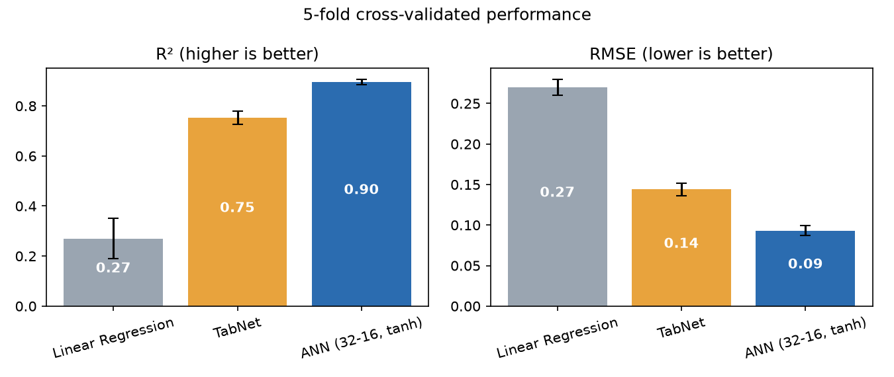
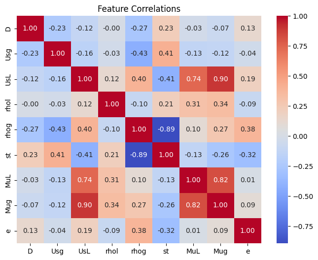
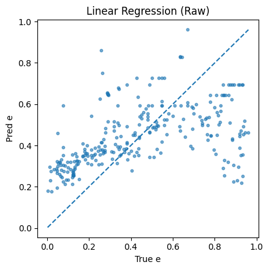
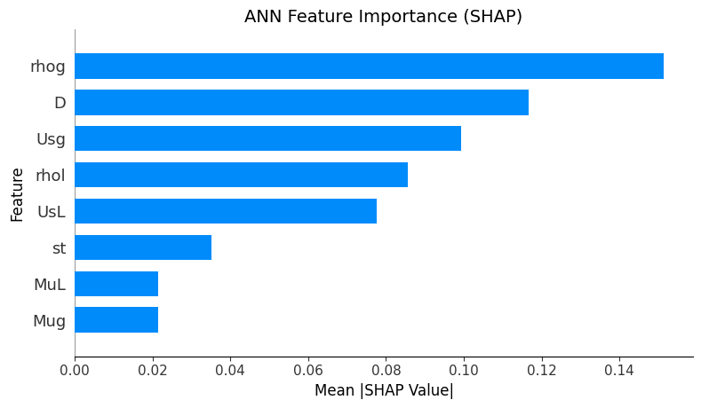
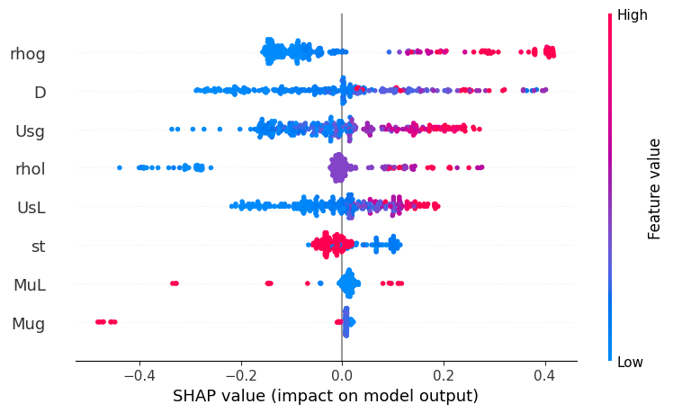
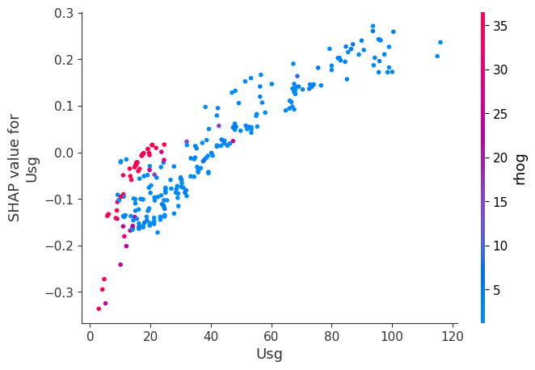
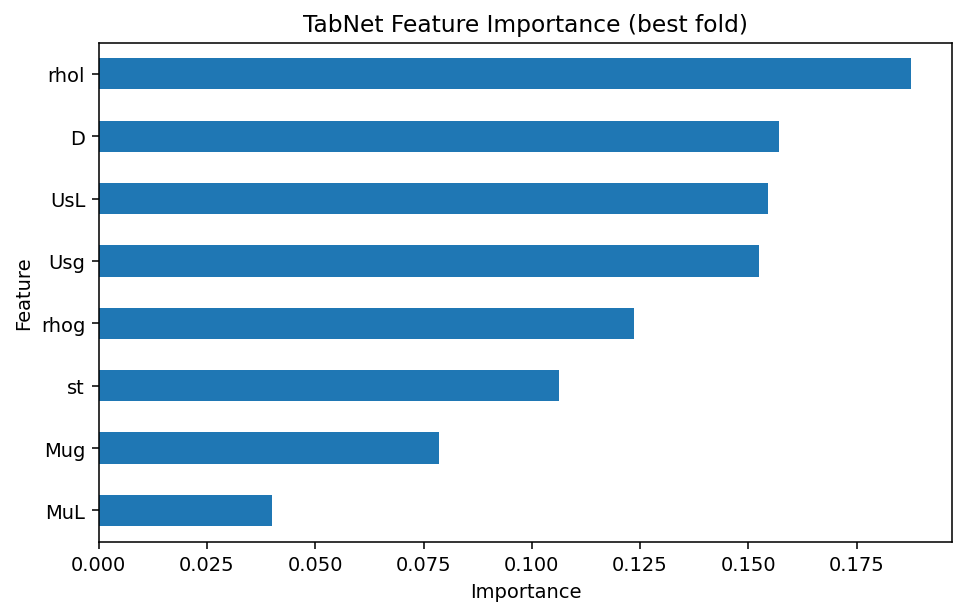

# Predicting Entrained Droplet Fraction in Gas–Liquid Flow with Neural Networks

Graduate capstone: can a **compact, regularized neural network** reliably predict the entrained droplet fraction (EDF) in vertical gas–liquid flow, while staying fast to train and physically interpretable?

**Topics:** multiphase flow · PyTorch · SHAP · TabNet · cross-validation · engineering data



## Summary

Liquid entrainment strongly affects pressure gradient, phase holdup, and separation efficiency. Classical correlations tend to fail outside their calibration ranges because EDF depends on coupled, nonlinear interactions among fluid properties, flow rates, and pipe geometry.

Using the experimental dataset of Aliyu et al. (2017), this project compares three lightweight, transparent models under identical 5-fold cross-validation:

| Model | R² (mean ± std) | RMSE (mean ± std) | Notes |
|---|---|---|---|
| Linear regression (baseline) | 0.27 ± 0.08 | 0.27 ± 0.01 | Underfits; EDF is strongly nonlinear |
| TabNet (interpretable attention model) | 0.75 ± 0.03 | 0.14 ± 0.01 | Logit-transformed target |
| **Compact ANN (8‑32‑16‑1, tanh)** | **0.896 ± 0.011** | **0.093 ± 0.006** | 833 trainable parameters |

The ANN delivered the best mix of accuracy, fold-to-fold stability, and physical consistency. SHAP showed that **gas density, superficial gas velocity, and pipe diameter** dominate its predictions, in line with established entrainment physics (gas momentum and geometry control droplet carryover).

> **Scope note.** Aliyu et al. reported R² ≈ 0.97 with a single-hidden-layer 8–6–1 sigmoid ANN trained with Levenberg–Marquardt. This project does **not** attempt to replicate that architecture, training procedure, or result. The aim is to show that a simple, conventional, well-regularized feed-forward network trained with modern tooling captures the main nonlinear physics and remains interpretable.

## Dataset

1,367 controlled vertical gas–liquid flow measurements with eight inputs (`D`, `Usg`, `UsL`, `rhol`, `rhog`, `st`, `MuL`, `Mug`) and one target, the entrained droplet fraction `e` ∈ [0, 1]. The data is third-party and not included; see [data/README.md](data/README.md).

Exploratory analysis ([notebooks/EDA_capstone.ipynb](notebooks/EDA_capstone.ipynb)) shows notable collinearity, e.g. `UsL`–`Mug` (0.90), `rhog`–`st` (−0.89), `MuL`–`Mug` (0.82). This matters for interpreting feature attributions below.



## Methods

All models use 5-fold cross-validation with seed 42 and per-fold preprocessing fit on training folds only.

| | Linear regression | ANN | TabNet |
|---|---|---|---|
| Input scaling | StandardScaler | StandardScaler | QuantileTransformer (→ normal) |
| Target | original scale | original scale | logit-transformed |
| Splitting | KFold | KFold | StratifiedKFold on binned target |
| Training | OLS | Adam (lr 1e‑3, weight decay 1e‑4), batch 128, 1,500 epochs/fold, MSE | AdamW, SmoothL1 loss, ReduceLROnPlateau, up to 1,800 epochs with early stopping |
| Architecture | – | 8 → 32 → 16 → 1, tanh hidden, sigmoid output | n_d = n_a = 32, 5 decision steps, sparsemax masks, sparse regularization |

The sigmoid output keeps ANN predictions inside [0, 1]. SHAP (KernelExplainer, 200 background / up to 500 evaluation samples) is applied to the best ANN fold and mapped back to original feature units.

## Results

### Linear baseline
Predictions collapse toward the mean and miss the high-EDF regime, confirming the problem is nonlinear.



### ANN and SHAP
Gas density, pipe diameter, and superficial gas velocity dominate; surface tension contributes with the expected negative sign; viscosities play a minor role, consistent with inertia- and interface-dominated entrainment.

| Global importance | Direction of effect |
|---|---|
|  |  |

SHAP dependence for superficial gas velocity shows a strong, near-monotonic increase with an interaction with gas density:



### TabNet
TabNet's attention masks give a complementary view, ranking liquid density highest, followed by pipe diameter and the superficial velocities. Its lower accuracy is likely driven by (1) attention spreading over correlated inputs (densities, velocities) and (2) the logit target transform compressing variation near 0 and 1.



Overall, both nonlinear models give a broadly consistent variable hierarchy, which increases confidence that the ANN is learning physical structure rather than noise.

### Classical ML reference
[results/classic_ml/classic_ml_cv_results.csv](results/classic_ml/classic_ml_cv_results.csv) holds cross-validated tree/kernel/linear baselines from the EDA notebook on raw and dimensionless (Re, We) features. For transparency: **Random Forest (R² 0.94) and Gradient Boosting (R² 0.92) score higher than the ANN on this dataset**. The capstone's focus is a compact, interpretable neural approach rather than beating every tabular baseline; dimensionless features did *not* help (best R² 0.76).

## Repository structure

```
├── notebooks/            EDA, ANN (5-fold CV + SHAP), TabNet (CV + attention masks)
├── src/
│   ├── config.py         shared features/target/seed/data path
│   ├── ann_cv.py         ANN 5-fold CV + SHAP, runnable as a script
│   ├── tabnet_cv.py      TabNet 5-fold CV, saved models and feature importances
│   └── make_comparison_figure.py
├── results/              CV metrics, model comparison, saved TabNet artifacts
├── figures/              figures used in this README
├── data/                 place the dataset here (not tracked)
└── archive/              earlier experiments kept for history
```

## Reproducing

```bash
python -m venv .venv && source .venv/bin/activate   # Windows: .venv\Scripts\activate
pip install -r requirements.txt
# put the dataset in data/ (see data/README.md), then:
python src/ann_cv.py            # ANN CV + SHAP figures  (--skip-shap to skip SHAP)
python src/tabnet_cv.py         # TabNet CV + final model, writes to results/tabnet/
python src/make_comparison_figure.py
```

Notes:
- The reported ANN numbers (R² 0.896 ± 0.011, RMSE 0.093 ± 0.006) come from `notebooks/ANN_capstone.ipynb` on a GPU. A CPU rerun of `src/ann_cv.py` gives R² ≈ 0.90 ± 0.01, RMSE ≈ 0.09, with small differences due to hardware-dependent RNG.
- `results/tabnet/` contains the saved best-fold and full-data TabNet models, scaler, and metadata from the reported run. Loading `.joblib` files executes pickled code; only load files you trust.

## Limitations and future work

- Small dataset (1,367 points) limited to vertical flow within the experimental ranges of Aliyu et al.; no extrapolation claims.
- Cross-diameter generalization (e.g. leave-one-diameter-out) has not been tested.
- Next steps: dimensionless-number feature engineering, uncertainty quantification, other flow regimes (slug/churn), benchmarking against classical entrainment correlations, and hybrid physics–ML models.

## Reference

Aliyu, A. M., et al. (2017). Entrained droplet fraction in vertical gas–liquid flow: experimental data and ANN modeling.

## License

MIT — see [LICENSE](LICENSE). The dataset remains the property of its original authors.
